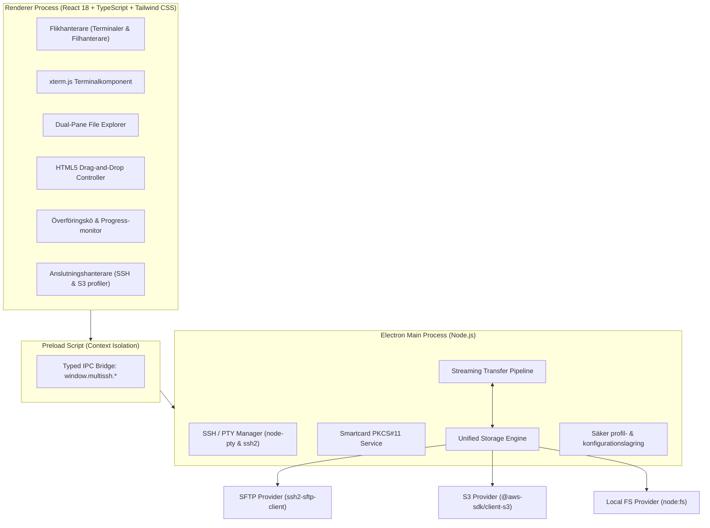

# Tekniskt designdokument: MultiSSH – SSH, SFTP & S3 Klient med Smartcard och Drag-and-Drop

**Datum:** 2026-09-14 20:05  
**Status:** Godkänd design  
**Plattformar:** Linux och Windows  

---

## 1. Mål och Översikt

MultiSSH är en modern skrivbordsapplikation som kombinerar:
1. **Fullfjädrad SSH-klient** med professionell terminalemulering (xterm.js) och flikhantering.
2. **Smartcard / PKCS#11-autentisering** för SSH genom att peka mot ett dynamiskt bibliotek (t.ex. Net iD `libiidp11` eller OpenSC `opensc-pkcs11`), med grafisk PIN-hantering och SSH-agent-stöd.
3. **Visuell SFTP-filhanterare** med dubbla paneler (dual-pane) och trädvy.
4. **S3-objektlagringsutforskare** kompatibel med AWS S3, MinIO och NetApp StorageGRID / ONTAP S3, med stöd för anpassade endpoints, Path-style addressing och självsignerade/anpassade CA-certifikat.
5. **Visuell Drag-and-Drop** för direkt överföring mellan SFTP, S3 och det lokala filsystemet via direkt strömmande pipelining i minnet (ingen onödig mellanlagring på disk).

---

## 2. Arkitektur och Teknikstack



### Valda bibliotek och teknologier
- **Ramverk:** Electron + TypeScript + React 18 + Vite / Electron-Forge / Electron-Builder.
- **Styling:** Tailwind CSS + Lucide React (ikoner) + Radix UI / headless primitives.
- **Terminal:** `xterm` + `@xterm/addon-fit` + `@xterm/addon-webgl` + `@xterm/addon-search`.
- **PTY & SSH:** `node-pty` (spawnar OpenSSH eller bash/powershell) samt `ssh2` för programmatiska anslutningar.
- **Smartcard / PKCS#11:** OpenSSH `-I <lib_path>` integration med `SSH_ASKPASS` för säker PIN-inmatning, samt detektering av Net iD och OpenSC-moduler.
- **SFTP:** `ssh2` och `ssh2-sftp-client`.
- **S3:** `@aws-sdk/client-s3` och `@aws-sdk/lib-storage` (för högpresterande multipart-uppladdningar).
- **Paketering:** `electron-builder` genererar:
  - Linux: AppImage, `.deb`, `.rpm`.
  - Windows: NSIS Installer (`.exe`), Portable (`.exe`).

---

## 3. Detaljerad Komponentdesign

### 3.1 Smartcard & PKCS#11-motor
Användaren kan konfigurera SSH-anslutningar med smartkort genom följande flöde:
1. **Biblioteksval:**
   - Standardförslag listas automatiskt baserat på operativsystem:
     - Linux: `/usr/lib/libiidp11.so`, `/usr/lib64/libiidp11.so`, `/usr/lib/x86_64-linux-gnu/opensc-pkcs11.so`, `/usr/lib/opensc-pkcs11.so`.
     - Windows: `C:\Program Files\Net iD\iidp11.dll`, `C:\Program Files (x86)\Net iD\iidp11.dll`, `C:\Program Files\OpenSC Project\OpenSC\pkcs11\onepin-opensc-pkcs11.dll`.
   - Anpassad sökväg kan väljas via en "Bläddra..."-dialog.
2. **Autentisering:**
   - När en session startas anropas OpenSSH med `-I <vald-sökväg>`.
   - För att förhindra att PIN visas i klartext ställs `SSH_ASKPASS` in mot en dedikerad intern IPC-kanal som visar en lösenordsmaskerad modal i appen och skickar tillbaka svaret säkert till OpenSSH.
   - Alternativt kan användaren välja att autentisera mot systemets befintliga `ssh-agent` / `Pageant`.

### 3.2 S3 Storage Provider (AWS, MinIO, NetApp)
S3-leverantören ansluter till godtycklig S3-kompatibel endpoint:
```typescript
export interface S3Config {
  id: string;
  name: string;
  endpoint?: string;              // Ex: http://192.168.1.50:9000 eller https://s3.netapp.corp
  region: string;                 // Standard 'us-east-1' för on-prem
  accessKeyId: string;
  secretAccessKey: string;
  sessionToken?: string;
  forcePathStyle: boolean;        // Sant för MinIO och NetApp IP/port-baserade endpoints
  ssl: boolean;
  rejectUnauthorized: boolean;    // Falskt för att tillåta självsignerade certifikat i labbmiljöer
  customCaPath?: string;          // Valfri sökväg till företagets CA-certifikat (.pem/.crt)
}
```
Funktioner i S3-bläddraren:
- Lista buckets vid root (`/`).
- Virtuell mappbläddring (uppdelning av objekt-nycklar med `/` som delimiter).
- Metadata-visning: Filstorlek, LastModified, StorageClass, ETag.
- Skapa ny virtuell katalog eller ny bucket.

### 3.3 Enhetligt Lagringsgränssnitt (`StorageProvider`)
För att möjliggöra drag-and-drop oavsett protokoll implementerar alla källor:
```typescript
export interface FileEntry {
  name: string;
  path: string;
  size: number;
  isDirectory: boolean;
  mtime?: Date;
}

export interface IStorageProvider {
  list(remotePath: string): Promise<FileEntry[]>;
  createFolder(remotePath: string): Promise<void>;
  delete(remotePath: string, isDirectory: boolean): Promise<void>;
  rename(oldPath: string, newPath: string): Promise<void>;
  createReadStream(remotePath: string): Promise<NodeJS.ReadableStream>;
  createWriteStream(remotePath: string, size?: number): Promise<NodeJS.WritableStream>;
}
```

### 3.4 Visuell Drag-and-Drop & Streaming Pipeline
1. **UI Interaktion:**
   - Användaren markerar en eller flera filer/mappar i vänster panel och drar dem till höger panel (eller tvärtom).
   - Drop-zonen identifierar käll- och målprovider (`source: { providerId, path }`, `target: { providerId, path }`).
2. **Pipelining utan mellanlagring:**
   - Vid överföring från SFTP till S3:
     - `SFTP.createReadStream(sourceFile)` kopplas direkt till `@aws-sdk/lib-storage` `Upload({ client: s3, params: { Bucket, Key, Body: stream } })`.
     - Data flyttas i minnesbuffertar (5 MB part-storlek för multipart upload) direkt över nätverket.
   - Vid överföring från S3 till SFTP:
     - `s3Client.send(new GetObjectCommand(...))` returnerar en läsbar ström som kopplas direkt till `SFTP.createWriteStream(targetFile)`.
3. **Överföringsövervakning:**
   - Framsteg per fil: överförda bytes, total storlek, procent, momentan hastighet (MB/s).
   - Köhantering med möjlighet att pausa, återuppta eller avbryta pågående jobb.

### 3.5 Användargränssnitt & Flikar
- **Toppmeny / Flikrad:**
  - `+ Ny Terminal`: Öppnar en SSH-terminalflik.
  - `+ Ny Filhanterare`: Öppnar en ny Dual-Pane filöverföringsvy.
  - Snabbknapp för "Sparade Anslutningar" och "Inställningar".
- **Dual-Pane Filhanterare:**
  - Vänster panel och Höger panel har var sin oberoende "Source Selector" dropdown:
    - [Lokala filer: `/home/user` eller `C:\`]
    - [SFTP: `prod-server (/var/www)`]
    - [S3 MinIO: `backup-storage (logs)`]
    - [S3 NetApp: `storagegrid (archive)`]
  - Brödsmulor (breadcrumbs) för snabb navigering.
  - Sök- och filtreringsfält.
  - Kontextmeny vid högerklick (Ladda ner, Ladda upp, Ta bort, Byt namn, Ny mapp, Egenskaper).

---

## 4. Säkerhet och Datahantering
- **Säker IPC:** Renderer-processen har `nodeIntegration: false` och `contextIsolation: true`. All kommunikation sker genom typade IPC-kanaler i `preload.ts`.
- **Lagring av inloggningsuppgifter:** SSH-lösenord och S3 Secret Keys sparas krypterat via systemets säkra nyckelring (t.ex. Secret Service på Linux / Credential Manager på Windows via SafeStorage API i Electron).
- **Smartcard PIN-skydd:** PIN sparas aldrig på disk och hålls enbart i temporärt flyktigt minne under sessionens initiering.

---

## 5. Verifierings- och Testplan
1. **Enhetstester:**
   - Test av `StorageProvider`-gränssnitten och path-normalisering (särskilt Windows backslashes mot S3/SFTP forward slashes).
   - Test av S3-klientinitiering med anpassade endpoints och `forcePathStyle`.
   - Test av strömningspipen och beräkning av överföringshastighet och progress.
2. **Integrationstester:**
   - SFTP-överföring mot mockad SSH/SFTP-server.
   - S3-objekthantering och multipart upload mot lokal MinIO / mock S3.
   - Smartcard-parameterverifiering (att `-I` flaggan och miljövariabler passas korrekt till OpenSSH).
3. **Manuell verifiering:**
   - Köra applikationen på Linux (testa terminal, SFTP-drag-and-drop och S3-bläddring).
   - Verifiera drag-and-drop mellan två paneler samt från externt filsystem.
   - Verifiera anslutning mot lokal MinIO-instans och mockade PKCS#11-bibliotek.
