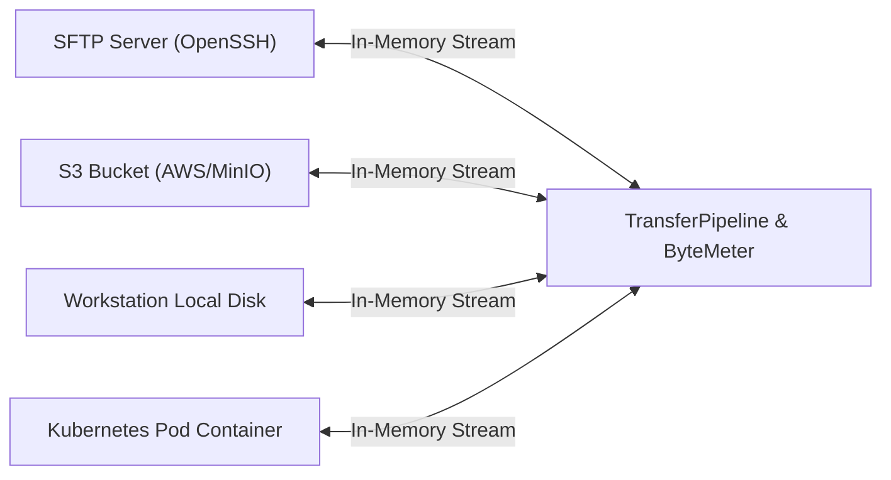

## Dual-Pane File Manager & SFTP Engine

The File Manager in **sshs3** provides a high-performance, keyboard-driven dual-pane explorer modeled after Midnight Commander and WinSCP, modernized for hybrid cloud infrastructure. It enables transparent file operations across local disks, remote OpenSSH SFTP servers, S3 object storage, and running Kubernetes containers.


---

## 1. Native OpenSSH SFTP v3 Engine

### Feature: Subsystem Execution via System OpenSSH

#### 🎯 Purpose
Replace vulnerable JavaScript SSH libraries with the operating system's native OpenSSH client to ensure uncompromising cryptographic security, hardware token compatibility, and seamless proxy routing.

#### 🛠️ How to Use
1. Launch the file manager via <kbd>Ctrl+Shift+F</kbd> or double-click an SFTP profile.
2. Navigate via keyboard (<kbd>Tab</kbd> switches active pane, <kbd>Enter</kbd> enters directories or opens files, <kbd>Backspace</kbd> ascends to parent folder).
3. Drag and drop files between panes or directly from your workstation's desktop.
4. Manage permissions via right-click → **Change Permissions (chmod)...** with octal (e.g. `0755`, `0644`) and symbolic checkboxes. Tick **Apply recursively to underlying files and folders** to apply the mode to everything inside a selected folder.

### Search in Files (<kbd>Ctrl+Shift+K</kbd>)

Opens **Search in Files** for the active pane's source: local disk, SFTP or S3.
- Choose **Literal** or **Regex**, and tick **Case sensitive** if needed.
- Narrow the search with **Include:** and **Exclude:** globs (for example `*.log, *.csv` and `*.min.js`).
- Matches stream in as they are found; select one to preview the surrounding lines, and use **Jump to file in pane** to open its location.
- The search stops at 500 matches (**Result limit reached — narrow your search to see more.**). On local disk, files larger than 50 MB are skipped, and on S3 objects larger than 10 MB; unreadable entries (sockets, system-protected files) are reported as warnings.

### Keyboard Ergonomics & Spatial Navigation

The file manager is designed to be fully operable without a mouse:
- **Spatial Navigation (<kbd>Ctrl+Shift+Arrows</kbd>)**:
  - <kbd>Ctrl+Shift+Left</kbd> / <kbd>Right</kbd>: Toggles focus directly between the left and right file pane.
  - <kbd>Ctrl+Shift+Up</kbd>: Shifts focus up to the **Tab Bar** (where <kbd>Left</kbd>/<kbd>Right</kbd> switches active workspace tabs, and <kbd>Down</kbd> or <kbd>Enter</kbd> returns focus into the file pane).
  - <kbd>Ctrl+Shift+Down</kbd>: Returns focus from the toolbar directly into the active pane's file list.
- **In the File List**:
  - <kbd>Up</kbd> / <kbd>Down</kbd>: Moves selection up and down.
  - <kbd>Enter</kbd>: Enters the selected folder or opens the file in the built-in viewer (focus remains in the file list).
  - <kbd>Escape</kbd>: Clears the current selection.

| Key / Shortcut | Action | Description |
| :--- | :--- | :--- |
| <kbd>Enter</kbd> | Open / Edit | Opens the selected folder, or opens the file in the built-in text editor. |
| <kbd>Backspace</kbd> / <kbd>Alt+Up</kbd> | Up Directory | Ascends one directory level up the tree. |
| <kbd>Alt+Left</kbd> / <kbd>Alt+Right</kbd> | History Back / Forward | Navigates through previously visited folders. |
| <kbd>Ctrl+C</kbd> / <kbd>Ctrl+X</kbd> / <kbd>Ctrl+V</kbd> | Copy / Cut / Paste | Clipboard operations across folders and protocols (cut items dim until pasted). |
| <kbd>Ctrl+A</kbd> | Select All | Highlights all files and folders in the active pane. |
| <kbd>Escape</kbd> | Clear Selection | Clears current file selections without changing directory. |
| <kbd>F2</kbd> | Rename | Renames the selected file or folder in place. |
| <kbd>Delete</kbd> | Delete | Prompts for confirmation and deletes selected items. |
| <kbd>F5</kbd> | Refresh | Re-reads directory listings from the underlying storage provider. |
| <kbd>Home</kbd> / <kbd>End</kbd> | First / Last Item | Jumps directly to the start or end of the directory list. |
| *Type letters* | Quick Jump | Typing characters immediately jumps focus to the matching file name. |
| <kbd>Ctrl+F</kbd> | Filter List | Filters visible items with wildcard matching (e.g. `*.log`, `data-?-final.csv`). |
| <kbd>Ctrl+Shift+K</kbd> | Search in Files | Recursive content search (with regex support) across local disk, SFTP, and S3. |

#### ⚠️ Limitations & Caveats
- SFTP v3 does not natively support advanced POSIX Access Control Lists (ACLs) within the protocol frame.
- Exceptionally large directory listings (>100,000 files) may take a few seconds to parse depending on network latency.

#### ⚙️ Technical Internals & Architecture
`SFTPStorageProvider` (`src/main/storage/SFTPStorageProvider.ts`) spawns the OpenSSH client in subsystem mode:
```bash
ssh <args from SmartcardDetector> -o BatchMode=no -s -- [user@]host sftp
```
- `SftpPacketProtocol` processes binary SFTP v3 packets (`SSH_FXP_INIT`, `SSH_FXP_OPEN`, `SSH_FXP_READ`, etc.) and rejects any packet larger than 16 MB, protecting against faulty or hostile servers.
- `SftpStreams` delivers `ReadableStream` and `WritableStream` with Node.js backpressure management, preventing memory exhaustion over saturated links.
- Hardware token touch prompts and smartcard PIN requests are handled transparently via the app's `AskpassServer`.

---

## 2. In-Memory Streaming Across Storage Providers

sshs3 implements a unified `IStorageProvider` abstraction for all storage backends:



### Feature: Zero Disk Staging Transfers

#### 🎯 Purpose
Enable direct file transfers between disparate storage systems (e.g., from an SFTP server directly to an Amazon S3 bucket, or from a Kubernetes pod to a local disk) without writing intermediate staging files to your workstation's hard drive.

#### 🛠️ How to Use
- Open an SFTP server in the left pane and an S3 bucket in the right pane.
- Select files and press <kbd>F5</kbd> (Copy) or drag and drop across panes.
- The transfer queue dock at the bottom displays progress, speed (MB/s), and estimated time to completion.
- Transfers can be paused and resumed at any time.

#### ⚠️ Limitations & Caveats
- Data streams through your workstation's network interface; transfer speed is bound by the slowest link.
- Suspending your workstation suspends the stream.

#### ⚙️ Technical Internals & Architecture
`TransferPipeline` (`src/main/transfer/TransferPipeline.ts`) pipes the source `createReadStream()` into the target `createWriteStream()`. `ByteMeter` calculates transfer velocity using a sliding 100ms window. `PauseController` suspends the Node.js stream flow without terminating underlying TCP sockets.

---

## 3. Conflict Resolution

When a destination file already exists, sshs3 presents an interactive collision dialog:


- **Overwrite**: Overwrites the existing destination file.
- **Skip**: Skips the file and advances the queue.
- **Rename**: Automatically saves the file under a new name instead of replacing the existing one.
- **Apply to all remaining conflicts in this transfer**: Applies the chosen action to all subsequent conflicts in the batch.

Under **Settings → Files & Storage → Default Conflict Resolution for File Transfers** you can choose **Ask** (the default), **Overwrite**, **Skip** or **Rename** so the dialog does not appear. Transfers in the queue can be paused, resumed and cancelled.

---

## 4. Directory Diff & Synchronization Engine


### Feature: Directory Synchronization

#### 🎯 Purpose
Compare a source directory with a target directory (on the same or different servers) and synchronize the differences, with a diff preview before anything is copied.

#### 🛠️ How to Use
1. Right-click a folder and select **Sync to...**, then pick the target folder. The **Sync Directory** dialog opens with the **Source** and **Target**.
2. Review the diff:
   - **New on source**: will be copied to the target.
   - **Modified**: will overwrite the target (newer target files are flagged).
   - **Only in target**: kept by default (*safe sync*).
   - **Identical**: nothing to do.
3. Optionally tick **Enable mirror (delete extraneous files in target)** to also delete files that exist only in the target. Deletions happen only for the files you select.
4. Run the sync. Enter a **Profile name** to save the configuration as a saved sync profile; saved profiles are listed under **Saved Sync Profiles**, where **Compute diff and run sync** repeats them.

#### ⚠️ Limitations & Caveats
- The sync is one-way, from source to target.
- Files are compared by size and modification time, with a fixed 2-second tolerance because SFTP and S3 backends truncate timestamps and clocks drift.

#### ⚙️ Technical Internals & Architecture
`DirectorySyncService` (`src/main/dirsync/DirectorySyncService.ts`) traverses directory hierarchies in memory, categorizes files, and enqueues sync tasks through `TransferQueue`.

---

## 5. Built-in Editor, Live Log Tail & External Editor

### Feature: In-App Editing, Live Markdown & `tail -f`

#### 🎯 Purpose
Inspect and modify remote files or monitor server logs without launching an external editor or switching to a terminal window.

#### 🛠️ How to Use
- **Built-in Editor**: Double-click or press <kbd>Enter</kbd> on a text file to open it in the built-in viewer. Press <kbd>Ctrl+S</kbd> to save directly back to the remote server. For documentation files, toggle the **Source / Preview** switch for an instant live-rendered Markdown preview.
- **Live Log Tail**: Right-click a growing log file (e.g. `access.log`, `app.log`) and select **Tail -f (Stream Log)**. The editor streams new lines in real time and is read-only while tailing; click **Stop Tail -f** to end the stream.
- **External Editor**: Right-click any file and select **Open in External Editor**. The file opens in your local desktop IDE (VS Code, Neovim, Sublime). Press <kbd>Ctrl+S</kbd> locally, and sshs3 automatically detects the file write and streams updates back to the server in the background!

#### ⚠️ Limitations & Caveats
- The built-in editor is optimized for lightweight text/markdown editing without heavy syntax trees. For complex multi-file projects, use External Editor hand-off.
- External editors must save files in place without breaking filesystem inode watches.

#### ⚙️ Technical Internals & Architecture
`FileEditorService` downloads target files into an isolated temporary directory with `0700` permissions, launches the local application via Electron `shell.openPath()`, and registers an `fs.watch` event listener. When change events fire, modified buffers stream back across `TransferPipeline`.

---

## 6. Git Integration in the File Manager

### Feature: Visual Git Status & SFTP Repository Management

#### 🎯 Purpose
Inspect Git repository status, pull updates, or clone repositories directly within remote SFTP folders without opening a separate terminal session.

#### 🛠️ How to Use
1. When browsing a folder containing a `.git` directory (locally or over SFTP), sshs3 automatically detects the repository:
   - **Branch & Status Indicator**: Displays active branch, uncommitted/untracked changes, and commit delta ahead (↑) or behind (↓) `origin`.
   - **Git Pull**: Click the pull icon to synchronize the remote repository with upstream in a single click.
   - **Open in GitHub/GitLab**: Opens the repository homepage in your default browser when `remote.origin.url` is configured.
   - **Clone Git repository here...**: Right-click any folder to clone a repository with optional shallow-clone depth (`--depth=1`).
2. Git polling can be toggled on or off under *Settings → Git & GitHub* to eliminate background network checks on constrained servers.

#### ⚠️ Limitations & Caveats
- Remote Git operations over SFTP require `git` to be installed on the remote server.

#### ⚙️ Technical Internals & Architecture
Driven by `GitStatusService` (`src/main/git/GitStatusService.ts`) and `RemoteGitService` (`src/main/git/RemoteGitService.ts`). Remote status inspections run non-blocking `git status --porcelain=v2` commands over the ControlMaster channel.

---

## 7. Troubleshooting & Diagnostics Runbook

| Symptom / Error Message | Probable Root Cause | Corrective Action |
| :--- | :--- | :--- |
| `Permission denied` on file upload | Remote directory lacks write permissions for user | Verify directory permissions via `ls -ld <folder>`. Run `chmod 755` or elevate via sudo in a terminal. |
| `SFTP subsystem not found` | Remote server's `sshd_config` lacks SFTP subsystem | Ensure `Subsystem sftp /usr/lib/openssh/sftp-server` is configured in `/etc/ssh/sshd_config`. |
| External editor edits do not upload | Editor saves via atomic temporary files | Configure your editor to write in place (e.g. in Vim: `:set backupcopy=yes`). |
| Transfer hangs at 99% | Remote partition exhausted available disk space | Run `df -h` on the remote server to ensure free space is available. |
