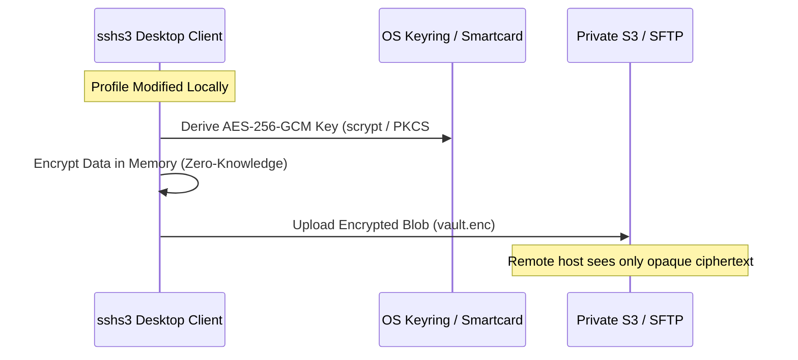

## Environment & Profile Synchronization

**sshs3** provides synchronization tools designed to keep your terminal shell settings and connection profiles synchronized across multiple workstations without compromising privacy or relying on third-party cloud accounts.


---

## 1. Dotfiles Pool Sync (Opt-In)

Reconfiguring `.bashrc`, custom aliases, `.vimrc`, or `.tmux.conf` on hundreds of remote servers is tedious. sshs3 offers an opt-in **Dotfiles Pool Sync**:

### Feature: Session-Staged Dotfiles Environment

#### 🎯 Purpose
Deliver a customized, familiar shell environment on every remote server upon login without modifying or polluting permanent server-wide system configuration files.

#### 🛠️ How to Use
1. Open **Settings → Files & Storage**, tick **Enable dotfiles pool sync (off by default)**, and click **Manage Dotfile Pools**.
2. Click **Add Files...** or drag files in (e.g. `~/.bash_aliases`, `~/.config/nvim/init.vim`). Nothing is added in bulk, so pooling only `~/.kube/config` means picking just that specific file.
3. You can also right-click any file in the dual-pane file manager and choose **Add to Dotfiles Pool...**.
4. Pooled files are displayed grouped by target directory, complete with:
   - **Read-only preview** of file contents.
   - **File Mode** (permissions).
   - **Status indicator** highlighting whether the local source file has changed on disk since being pooled. Click **Refresh** to re-read changed source files.
   - **Open Master Directory**: Click to open the master pool storage folder directly in your system file manager to edit or reorganize pooled files.
5. In any SSH profile under *Environment*, select the **Dotfiles Pool** to attach and choose a synchronization policy (e.g. Silent update or interactive diff banner upon connection).

#### ⚠️ Limitations & Caveats
- Pooled files are stored unencrypted on your local workstation. **Avoid pooling files that contain unencrypted passwords, private keys, or cloud API tokens**.

#### ⚙️ Technical Internals & Architecture
`DotfilePoolStore` (`src/main/dotfiles/DotfilePoolStore.ts`) manages pool definitions. Upon SSH connection, a short-lived SFTP check compares files against remote timestamps. Staged files are placed in an isolated temporary session directory and sourced automatically.

---

## 2. Remote Profile Synchronization ("Own Your Data")

For operators working across multiple laptops and desktop workstations, sshs3 provides end-to-end encrypted profile synchronization.

### Philosophy: "Own Your Data"
sshs3 maintains **no central proprietary cloud servers or accounts**. You select your own storage backend:
- A private **Amazon S3 bucket** (or MinIO, Cloudflare R2).
- A private remote **SFTP server**.



### Feature: Zero-Knowledge AES-256-GCM Profile Sync

#### 🎯 Purpose
Synchronize connection profiles, credentials, folders, and application settings across devices with guaranteed zero-knowledge cryptographic privacy against storage providers and network eavesdroppers.

#### 🛠️ How to Use
1. Open *Settings → Synchronization*.
2. Choose a backend (**S3** or **SFTP**) and enter your target credentials.
3. Choose a strong **Master Password**.
   - *Advanced:* Toggle "Use separate passwords" to maintain separate passwords for topology (hostnames and folders) vs. credentials (passwords, keys, API secrets).
4. **Smartcard & Hardware Token Unlock (PKCS#11 / SITHS / YubiKey)**: Choose the smartcard library under **Smartcard / Hardware token** and click **Link smartcard**. Later you unlock sync with **Unlock with Smartcard** and only your smartcard PIN.

#### ⚠️ Limitations & Caveats
- **RSA / Ed25519 vs. ECDSA for Key Derivation**:
  > [!IMPORTANT]
  > Linking a card so it can *derive* the master encryption key directly requires an **RSA or Ed25519** key. These algorithms sign deterministically, producing the exact same wrapping key upon each unlock. **ECDSA cards** (common on PIV/CAC) sign with a random nonce each time and cannot reliably derive static keys; for ECDSA, unlock with master passwords once and use the card for session unlocking.
- **Tombstones**: Deletions record cryptographic tombstones to prevent purged records from re-appearing after multi-device synchronization.

#### ⚠️ What is never synced
- Machine-specific fields stay local and are ignored if they arrive from another device: the private key path, PKCS#11 library path, agent path and agent identity files of a profile, plus the settings **X server path**, **X server arguments** and the global smartcard library path. A smartcard PIN is never stored or synced.
- After a wrong master password the keys are not kept in memory; unlock again with the right password before pushing.

#### ⚙️ Technical Internals & Architecture
Data is encrypted with **AES-256-GCM** using keys derived via **scrypt** (N=32768, r=8, p=1). Synchronization executes on a per-record basis reconciled by `updatedAt` timestamps, preventing independent edits on two workstations from clobbering each other.

---

## 3. Managed Block in `~/.ssh/config`

### Feature: Automatic CLI Configuration Synchronization

#### 🎯 Purpose
Ensure all SSH profiles saved in sshs3 are instantly accessible when running plain `ssh <host>` commands in external terminal emulators, IDEs, or automated scripts.

#### 🛠️ How to Use
- Under *Settings → Terminal*, verify **Keep ~/.ssh/config in sync with saved SSH profiles** is checked.
- Whenever a profile is added or edited, sshs3 updates a managed block in your local `~/.ssh/config`:

```ssh-config
# BEGIN sshs3 managed block (do not edit manually)
Host prod-db
  HostName 10.0.4.12
  User dbadmin
  Port 22
  IdentityFile ~/.ssh/id_ed25519
  ProxyJump bastion.example.com
# END sshs3 managed block
```

#### ⚠️ Limitations & Caveats
- Configurations outside the managed block are left completely untouched.
- A managed block received from another machine is filtered before it is written: only the directives sshs3 itself generates (`Host`, `HostName`, `Port`, `User`, `IdentityFile`, `PKCS11Provider`, `ProxyJump`, `ForwardAgent`) and a short list of harmless connection options (such as `ServerAliveInterval`, `Compression`, `Ciphers`) are kept. Everything else, including `ProxyCommand`, `LocalCommand`, `Match`, `Include` and host-key related directives, is stripped.
- A profile's free-form extra SSH options follow the same allowlist, both in this block and on the `ssh` command line sshs3 starts; other options are ignored. Use the profile's own fields for identity files, jump hosts, agent forwarding and X11.

#### ⚙️ Technical Internals & Architecture
`SshNativeFileMerger` writes atomically using a temporary file (`~/.ssh/config.tmp.PID`) followed by an atomic rename, eliminating file corruption if the process terminates mid-write.

---

## 4. Troubleshooting & Diagnostics Runbook

| Symptom / Error Message | Probable Root Cause | Corrective Action |
| :--- | :--- | :--- |
| `Wrong master password / MAC mismatch` | Incorrect master password entered during unlock | Re-enter password carefully. Three failures trigger a 5-minute security throttle. |
| `ECDSA key not supported for key derivation` | Linked smartcard uses an ECDSA algorithm | Unlock with your master password and use the card for session caching instead. |
| `Sync conflict detected` | Same profile modified concurrently on two devices | Review the conflict resolution dialog to select which version should take precedence. |
| Remote vault corrupted | Incomplete write or network failure during upload | Use "Restore from local backup" in Settings to overwrite the remote vault with your local state. |
