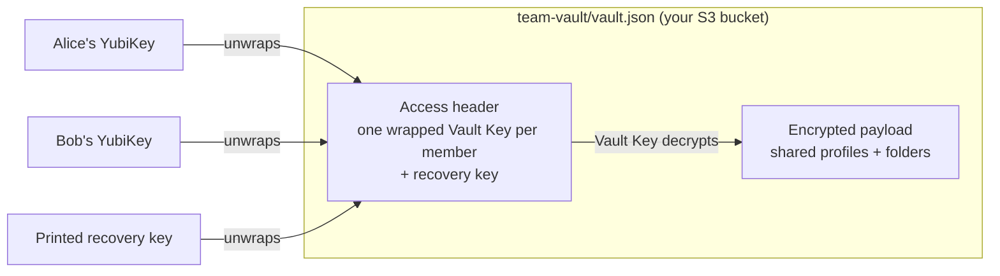

## Team Vault: Shared Connection Profiles

**Team Vault** lets a team share SSH and S3 connection profiles (including passwords and secret keys) through a bucket you own. There is no shared master password and no sshs3 account: every member unlocks the vault with their own **YubiKey**. Removing someone is a single click, and the S3 provider only ever sees ciphertext.

It is a separate feature from [Remote Profile Synchronization](/docs/sync-environment/), which syncs *your own* profiles between *your own* machines. Your personal profiles never enter the Team Vault, and shared profiles never land in your personal profile store.

---

## 1. Before You Start

#### ✅ Requirements
- **A YubiKey with PIV** for every member (YubiKey 4 or 5 series). Other PIV smartcards (Gemalto, Thales, SITHS cards, etc.) **cannot** be used: the vault relies on `age-plugin-yubikey`, which speaks the YubiKey's own management protocol, not generic PIV/PKCS#11.
- **Linux.** Team Vault is not supported on Windows yet (unlocking relies on a Unix named pipe).
- `pcscd` installed and running (the same service smartcard SSH login already needs).
- **An S3-compatible bucket** that everyone in the team can read and write (AWS S3, MinIO, …). SFTP is not supported as a Team Vault target.

#### 🔑 Prepare your YubiKey (once)
A PIV card has three separate secrets: the **PIN**, the **PUK** and the **management key**. Changing the PIN and PUK does *not* change the management key.

| Card state | What to do |
|---|---|
| Factory-default PIN `123456` / PUK `12345678` | Change them first: `ykman piv access change-pin` and `ykman piv access change-puk`. sshs3 refuses to drive the card's change-PIN wizard for you and stops with *"This YubiKey still has its factory-default PIN/PUK"*. |
| PIN/PUK changed, management key still factory default (common on YubiKey 4) | Nothing. The first **Generate my Team Vault ID** migrates the management key to a PIN-protected one using the PIN you just entered. |
| Management key changed by you, but not PIN-protected | Run `ykman piv access change-management-key --generate --protect` once. sshs3 does not know your custom management key and will not guess it. |

> [!NOTE]
> **Generate my Team Vault ID** creates a *new* key in one of the YubiKey's spare ("retired") PIV slots. Your existing SSH key in slot 9a is not touched.

---

## 2. Create a Vault (first admin)

1. Open **Settings → Team Vault** and click **Generate my Team Vault ID**. Enter your PIV PIN in the dialog and touch the key when the touch banner appears.
2. Fill in **Your recipient id**, a label other members will see, e.g. `alice@piv:yubikey-1`. If a smartcard certificate is configured for Remote Profile Sync, sshs3 suggests your UPN.
3. Optionally set a **Vault name (optional)**, e.g. *Acme Infra Team*. The name is shown instead of the internal id and on the Connection Manager tab.
4. Click **Create Vault**. You become the vault's first **Admin**.
5. **Save your recovery key now.** It is shown exactly once. Use **Copy** or print it, store it somewhere safe (e.g. a safe), tick **I have printed/saved this recovery key** and click **Done**. See [Recovery](#7-recovery-when-a-card-is-lost).

#### ☁️ Connect the vault to S3
1. Under **Remote sync (S3)** click **Configure target**.
2. Enter the S3 endpoint and credentials, and the bucket (optionally `bucket/prefix`). The vault is stored as `team-vault/vault.json` under that location. The credentials are encrypted at rest in your OS keychain, like every other credential in sshs3.
3. Click **Push** to upload the vault.

The admin can rename the vault later with the pencil next to **Vault** in **Settings → Team Vault**.

---

## 3. Add Members

Each new member identifies themselves with a **join-info** blob. It holds only their recipient id and *public* key, so it is safe to send over chat or email.

**The new member:**
1. Opens **Settings → Team Vault**, clicks **Generate my Team Vault ID** (PIN + touch), fills in **Your recipient id**.
2. Clicks **Copy join info** and sends the copied text to an admin.

**The admin:**
1. Unlocks the vault (see [Unlock](#5-unlock)).
2. Pastes the whole blob into **Add a member**. Surrounding chat text is ignored, and the parsed recipient id and key are shown for confirmation.
3. Picks **Member** or **Admin** and clicks **Add member**.
4. Clicks **Push**. Membership changes are not pushed automatically.

**The new member then joins:**
1. Configures the **same** S3 target under **Remote sync (S3)**.
2. Clicks **Pull existing vault**, which appears when a vault already exists at that location.
3. Unlocks.

---

## 4. Roles

| | Admin | Member |
|---|:---:|:---:|
| Connect with, add, edit and delete shared profiles and folders | ✅ | ✅ |
| See shared passwords and secret keys | ✅ | ✅ |
| Add / remove members, **Promote** / **Demote** | ✅ | ❌ |
| Rename the vault | ✅ | ❌ |
| **Remove vault from this machine** | ✅ | ❌ |

Roles are enforced in the main process, not just hidden in the UI.

> [!IMPORTANT]
> Every member can read every shared credential. Only add people who should have the same access as everyone else in the vault.

Keep **at least two admins**. The settings page warns when there are fewer: if the only admin loses their card, only the recovery key can manage the vault.

**Removing a member** (**Remove member**) generates a new Vault Key and re-encrypts everything for the remaining members. The removed member keeps whatever they had already synced, but cannot read anything changed after the removal. After pulling such a change, other members are asked to unlock again.

---

## 5. Unlock

Shared profiles are only readable while the vault is unlocked. Unlock from either:
- **Connection Manager** → the vault's tab → **Unlock as *your-id***, or
- **Settings → Team Vault** → **Unlock**.

Enter your PIV PIN and touch the key. sshs3 remembers *which* identity you used last (not your PIN), so normally there is only a button to press. **Use a different identity...** lets you enter a recipient id and identity file by hand, e.g. on a new machine.

The Vault Key is kept in memory only and is discarded when you quit sshs3. It is never written to disk or the OS keychain.

---

## 6. Using Shared Profiles

Open the **Connection Manager**. Next to **Personal** there is a second source toggle named after the vault (or **Team** if it has no name). Everything you create there is saved to the vault, not to your personal profiles.

- **New Profile**, edit, **Duplicate profile** and **Delete profile** work like personal profiles. **Connect** and **SFTP** connect directly.
- **Manage tunnels** and **Install public key** are not available on shared profiles.
- **Private key paths** are shared as-is and only work if every member has the key at the same path. Such profiles are marked with a warning.
- **Smartcard profiles:** leave the PKCS#11 library path empty. Each member's own default from **Settings → Security & Smartcard** is then used, so a new member does not have to edit every shared profile. A path set on the profile itself still overrides it.
- A smartcard or FIDO2 **PIN is never stored** in a shared profile, exactly as for personal profiles.

#### 📁 Folders
Shared profiles are organised in a folder tree that is the same for every member. Folders can be nested to any depth, e.g. *Acme Infra → Cluster A*, *Cluster B*, *Jumpbox*.

- Folders are shown as **cards**. Click a card (or press <kbd>Enter</kbd> on it) to open it. The breadcrumb (**Back** / **All folders** / …) takes you back up.
- **New top-level folder** / **New subfolder** creates a folder at the level you are viewing.
- Put a profile in a folder by **dragging** it onto a card or onto a breadcrumb segment, or by typing a path in the profile's **Group / Folder (optional)** field, e.g. `Acme Infra/Cluster A`. Existing folders are suggested as you type.
- Each card has **Rename folder** and **Delete folder** buttons. Deleting a folder moves the profiles inside it (including its subfolders) to **Ungrouped**; it does not delete them.
- Click the folder icon on a card to pick a different icon (server, database, cloud, shield, …).

#### 🔍 Search
Typing in the search box searches **all** shared profiles, not just the open folder. Results are shown as a flat list, each labelled with its folder path. Clear the search to return to the folder you were in.

#### 🔄 Keeping everyone in sync
- **Your changes** to shared profiles, folders or the vault name are pushed automatically about two seconds after you save.
- **Other members' changes** are checked for every three minutes while the vault is unlocked and pulled automatically. The Connection Manager shows *"Updated from another member"* when that happens.
- If you have local changes that were not pushed yet, sshs3 does not overwrite them. It shows *"A newer version is available — push your changes to sync"* instead.
- **Push** is refused if someone else pushed in the meantime: **Pull** first.
- **Pull** with unpushed local changes asks for confirmation (**Pull anyway (discard local changes)**). Pulling into an existing vault requires it to be unlocked, so the downloaded file can be verified.

---

## 7. Recovery When a Card Is Lost

The recovery key is an extra key that can unlock the vault on its own, with admin rights. It is not tied to any hardware.

1. On any machine with the vault (use **Pull existing vault** on a new one), open **Settings → Team Vault**.
2. Click **Lost your card? Recover using your saved recovery key...**
3. Paste the recovery key text (the block starting with `AGE-SECRET-KEY-1…`, surrounding text is ignored) and click **Recover vault access**.
4. Add yourself (or a replacement admin) back with a new YubiKey via **Add a member**, **Push**, and remove the lost card's entry.

sshs3 never stores the recovery key: the pasted text is passed to the decryption step in memory and discarded.

#### 🧹 Removing the vault from one machine
**Remove vault from this machine** (admin) deletes only the local copy and the remembered identity. The S3 copy and other members are not affected, and you can get it back with **Pull existing vault**.

---

## 8. Security Model & Limitations

#### What is protected
- **The S3 provider and anyone with only bucket access** see ciphertext. Profiles are encrypted with AES-256-GCM under a random Vault Key, which is wrapped individually for each member's YubiKey and for the recovery key.
- **Tampering with the file in the bucket** is detected: the member list is covered by a MAC derived from the Vault Key. A pulled vault is refused if it is an older revision than the one you have (rollback), belongs to a different vault, or changes an existing member's key.
- Downloads of the vault file are capped in size.

#### Known limitations
- **Every member can read every shared secret.** Restricting passwords to admins only is planned but not built.
- The member list is protected by a shared-key MAC, not per-admin signatures. Someone with both write access to the bucket *and* a valid Vault Key could alter it. Bucket access alone is not enough.
- **YubiKey only**, **Linux only**, **S3 only**, and **one Team Vault per machine**.
- A removed member keeps the data they had already synced before removal.

#### ⚙️ Technical Internals & Architecture
`TeamVaultService` (`src/main/services/TeamVaultService.ts`) owns the local vault file (`team-vault.json` in the app's user-data directory) and the in-memory Vault Key. `TeamVaultCryptoService` wraps and unwraps the Vault Key with the bundled `age` + `age-plugin-yubikey` binaries. PIN prompts go through a pseudo-terminal to the app's own PIN dialog, and the unwrapped key is read back through a named pipe, so it never touches disk. The S3 target is stored separately in `team-vault-sync-config.json`. Design notes and decision history: [`docs/team-vault-plan.md`](https://github.com/alun-hub/sshs3/blob/master/docs/team-vault-plan.md).
